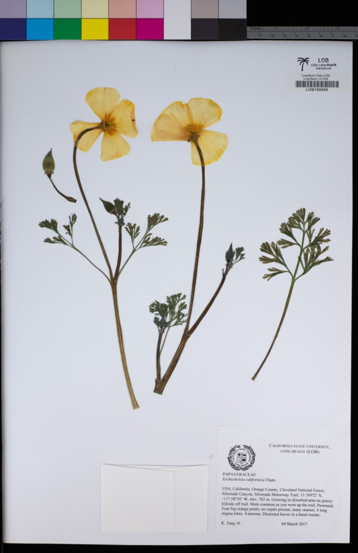

<link rel="stylesheet" href="styles.css" type="text/css">

The CSULB Herbarium holds approximately 18,000 specimens of preserved plants and is a historic record of the wild plants in coastal Southern California. The collection is largely from Los Angeles, Orange, and Riverside Counties. We are listed in the [Index Herbariorum](http://sweetgum.nybg.org/science/ih/) and our herbarium code is LOB.

We are a member of the NSF-funded Capturing California's Flowers California Phenology Project (led by Dr. Jenn Yost at Cal Poly San Luis Obispo) and we have databased the collection in the [CCH2 Portal](http://www.portal.capturingcaliforniasflowers.org/portal/index.php).  The herbarium received NSF funding for digitization in July, 2018. In Spring, 2019 three student assistants and 15 volunteers imaged specimens and we completed imaging in 2021. Our specimen records are also searchable in GBIF. 

The herbarium collection continues to grow with new specimens from student and research collections. 

