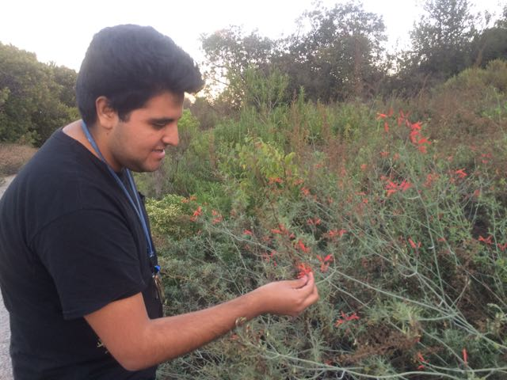
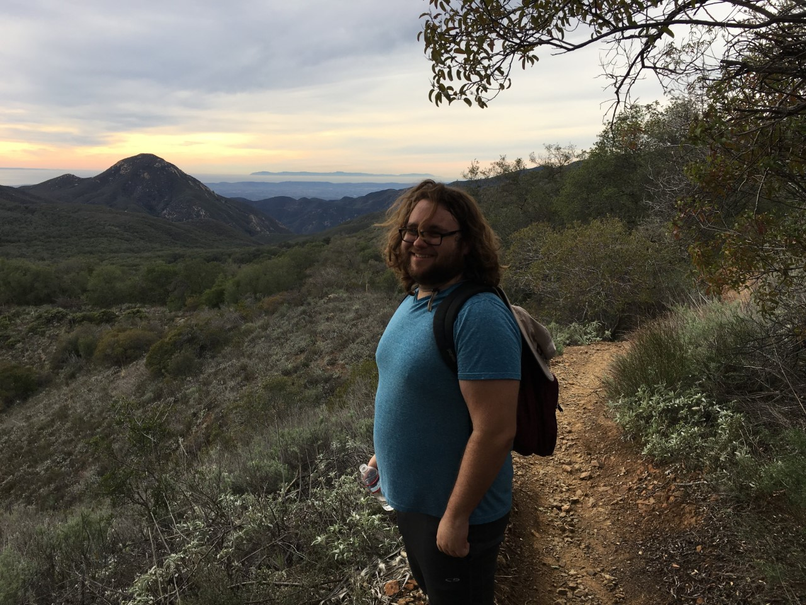
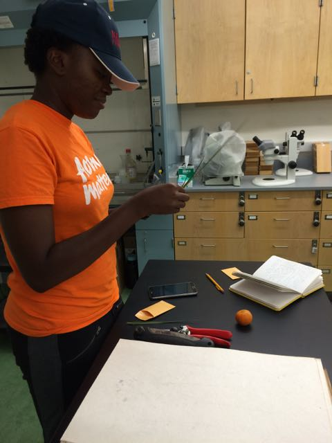

<link rel="stylesheet" href="styles.css" type="text/css">

# Current lab members

#### Joshua Arias 
is an MS student studying the phylogenomics of Acanthaceae focusing on the BAWN clade. He will be entering a PhD program at UC Riverside in Fall, 2018.

####Laymon Ball 
is a BS student. She was a PLANTS mentee for the Botany 2017 conference in Fort Worth, Texas.  She also received a scholarship to attend the Systematics Research Institute at Rancho Santa Ana Botanic Garden for Summer, 2018.  

####Robert Comito 
is an MS student studying the molecular phylogeny of *Barleria* using RADseq.

####Sara Cuadra 
is a BS student in the herbarium. 

####Emily Do 
is a BS student working on Acanthaceae leaf anatomy. She was awarded the Bennett and Peggy Kayser Research Award in 2018.

####Semaria Kassa 
is a BS student in the molecular lab. 

####Harrison McGowan 
is an MS student working on the flora of the Chiquito Basin in the Santa Ana Mtns, Cleveland National Forest, California. He received a scholarship to attend the Systematics Research Institute at Rancho Santa Ana Botanic Garden for Summer, 2018.

####Amy Nguyen
is a BS student in the molecular lab.

####Bryana Olmeda
is the undergraduate collections manager of the herbarium. 

####Keana Tang
is a BS student and an intern at the Los Angeles Natural History Museum. She was formerly an intern for the Trinity Shasta National Forest. She will also be a PLANTS mentee at the Botany 2018 conference in Rochester, Minnesota and received a scholarship to attend the Systematics Research Institute at Rancho Santa Ana Botanic Garden for Summer, 2018.

# Former lab members

Nneka Aruoma 

Brittany Betz

Sierra Coleman

Carolina Contreras

Asusena Figueroa

Hannah Garfin entered the CSULB MS GIS program

Karla Gonzalez

Mark Noda is employed at Paragon Labs

Krystiana Oberhammer  is employed at KP Environmental

Bridgette Saroff

Chenyu Shen

Renee Stewart

Alan Vera
