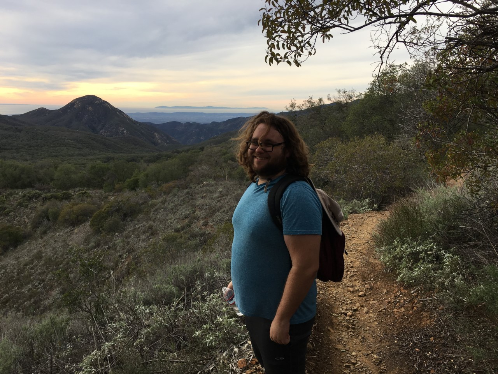
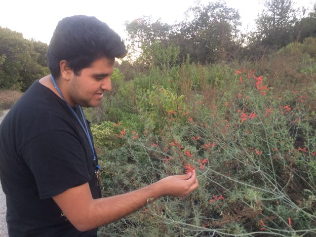
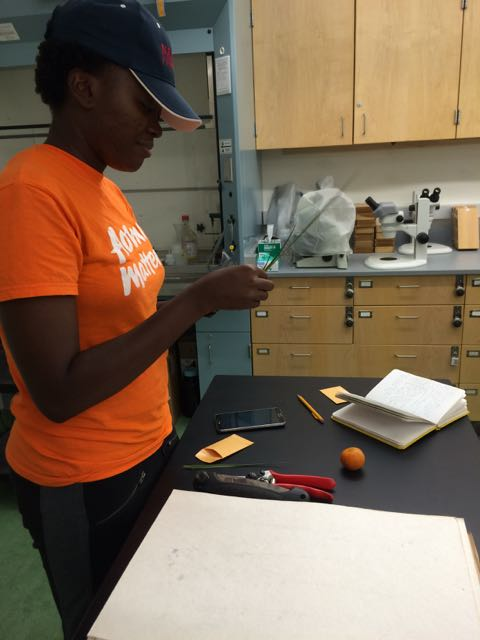

<link rel="stylesheet" href="styles.css" type="text/css">

# Current lab members

#### Amanda Fisher
I am a Professor of Botany and Curator of the Herbarium (LOB) at [Long Beach State University](https://www.csulb.edu). I regularly teach upper-level Botany courses in the Department of Biological Sciences (BIOL427, BIOL439). I am particularly interested in plant systematics and how flowers have evolved with pollinators. Some of my students work on floristics- the study of plant diversity in a particular place. I graduated from the [University of Iowa](https://clas.uiowa.edu/envsci/) in 2004 with a BS in Environmental Sciences on the Botany track. In 2005 I began a PhD in Biology with Dr. Scot Kelchner at [Idaho State University](https://www.isu.edu/bios/), working on the systematics of the neotropical bamboo genus *Chusquea*.  In 2011 I began an NSF-funded postdoctoral fellowship at [Rancho Santa Ana Botanic Garden](https://rsabg.org) in Claremont, California to work on chloridoid grass systematics with Dr. Travis Columbus. Then in 2013 I had the pleasure of being an RSABG postdoctoral fellow, working with Dr. Lucinda McDade on the systematics of several Acanthaceae genera (*Barleria, Dyschoriste*). My recent work has been on resolving the Acanthaceae phylogeny using nuclear loci and investigating  patterns of pollinator shifts and macro-evolutionary effects on floral morphology. 

I am currently looking for undergraduate and MS students to research plant evolution and diversity. Please contact me if you are interested in joining the lab! 

Amanda [dot] Fisher [at] csulb [dot] edu

### Nicholas Rocha 
is a MS student in the lab where he is working on a florula of the Lay, Glass, and Lower Filiorum Reserves of Palos Verdes Peninsula. He is also studying the population structure of a rare shrub that occurs on the Peninsula, *Lycium* *brevipes* var. *hassei*. 

### Diego Uribe 
is working on the *Justicia* pollination project, primarily *Justicia* *sonorae*. 

### Yasmine Murad 
is working on the *Justicia* pollination project, primarily *Justicia* *sonorae*.

### Nickie Chanthavisith 
has assisted Nick Rocha with molecular lab work and is working on the *Justicia* pollination project.

### Nancy Nyugen 
works in the herbarium, mounting and repairing specimens 

# Lab alumni

### Leon Rubarts 
worked with M.S. student Nick Rocha of the flora of Glass, Lay, and Lower Filiorum Reserves on Palos Verdes Peninsula. He graduated in 2026 and immediately left to hike the Pacific Crest Trail. 

### Miguel Aranda 
worked in the herbarium, mounting specimens and organizing our seed cone collection.

### Jaylin Leon 
worked on the *Justicia* pollination project. She graduated with her B.S. in 2026. 

### Emily Fitzpatrick 
completed their undergraduate honors thesis in the lab. Their thesis was titled "Tecate cypress management in the Cleveland National Forest. Persistence in the face of fire" Emily presented at the 2025 Botany conference and the Southern California Botanists Symposium. Emily is now a research scientist in the Dept of Integrative Biology at University of Texas, Austin

### Kelsey Imrie 
worked on the *Justicia* pollination project. In 2025 she was awarded the competitive Summer Research Assistantship from the CSULB  Office of Research and Economic Development. She presented her project on variation in *Justicia* pollen production and pollinator adaptations in 2025. She is now a Biologist at AECOM.

### Annie Le 
was an undergraduate honors student in the lab. Her thesis was titled Vegetative anatomy and staminal development of American water willow, *Justicia americana* (Acanthaceae). She is now in Pharmacy School. 

### Valerie Tran 
was an undergraduate honors student in the lab. Her thesis was titled "Examining the relationship between pollinators and pollen size and shape in *Justicia* (Acanthaceae)"

### Tayahna Agtarap 
worked on the *Justicia* pollination project and presented a poster on her research at the National Conference for Undergraduate Research and a talk at the Orange County Chapter of the California Native Plant Society. 

### Kaya Sadi 
worked on the *Justicia* pollination project.

### Daniel Goldstein
worked on the *Justicia* pollination project. He is now in the Forensic Sciences Masters program at UC Davis.

### Josephine Palacios
did her MS research on the evolution of pollination in *Justicia*. Her work was funded by the National Science Foundation and she presented a poster at the 2021 Botany conference. 

### Yuting Wang
did her MS research on the phylogeny of the SAI clade of *Justicia* and evolution of corolla and pollen forms in the clade. Her work was funded by the National Science Foundation and she presented a poster at the 2021 Botany conference and at the 2023 CSUPERB symposium. 

### Daniel Donovan
did his MS research on the flora of Ladd Canyon in the Santa Ana Mountains, Cleveland National Forest, California. His research was published in the journal Aliso and he presented at the California Native Plant Society conference in San Jose, CA in 2022. He is now a field botanist at San Diego Museum of Natural History.

  

### Harrison McGowan 
did his MS research on the flora of the Chiquito Basin in the Santa Ana Mtns, Cleveland National Forest, California. He received a scholarship to attend the Systematics Research Institute at Rancho Santa Ana Botanic Garden in Summer, 2018 and presented his work at the 2019 Botany conference in Tucson, Arizona. He is now an ecological consultant in California.
  

  

### Amy Nguyen
was a BS student in the molecular lab. She is studying the anatomy of chloridoid grass leaves to test if particular leaf anatomy traits are correlated with the evolution of C4 photosynthesis subtypes. She presented her research at the Fall, 2019 CNSM Research Symposium. Amy was also an herbarium assistant, databasing for the California Phenology Project.

  

### Monica Soenjoto 
was a BS UROP student in the molecular lab.

  

### Marina Rice
was a BS student and the undergraduate Collections Manager of the Long Beach State Herbarium and team leader for the California Phenology Project. She also worked with MS student Harrison McGowan on the flora of the Chiquito Basin.

  

### Skye Idzinski
was a BS student and herbarium assistant. She databased for the California Phenology Project.

      

### Laymon Ball 
was a BS student who studied the rhizosphere diversity of chloridoid grasses and the reproductive biology of *Justicia californica*. Laymon was a PLANTS mentee for the Botany 2017 conference in Fort Worth, Texas.  She also received a scholarship to attend the Systematics Research Institute at Rancho Santa Ana Botanic Garden for Summer, 2018. In 2025 Laymon defended her Ph.D. in pollination biology from Dr. Laura Lagomarsino's lab at Louisiana State University.

### Angel Barnett
worked on the California Phenology Project in the Long Beach State Herbarium and graduated with a B.S. in Spring, 2019.

### Robert Comito 
was an MS student studying the molecular phylogeny of *Barleria* (Acanthaceae) using RADseq. Robert completed a Ph.D. in Botany at Rancho Santa Ana Botanic Garden and Claremont Graduate University in 2024. He is a visiting lecturer of Biology at the Claremont Colleges. 

### Sara Cuadra-Vargas
was a BS student and the undergraduate collections manager of the Long Beach State Herbarium (LOB). She was a pivotal member of the Long Beach State team for the California Phenology Project. After graduation Sara began an internship with the Long Beach Water Department, focused on the lawn to gardens program. She is currently a Conservation Biology with the Xerces Society. 

### Joshua Arias 
was an MS student studying the phylogenomics of Acanthaceae by combining transcriptome and genome-skim data. He defended his MS thesis in Spring, 2019 and began working on cancer research at the National Institutes of Health in Summer, 2019 with Dr. Sonja Berndt.

 
### Nneka Aruoma 
assembled transcriptomes of California cord grass *Spartina foliosa* and sectioned leaves for her undergraduate honors thesis. She graduated with her BS in Biology in 2018.
 
### Bryana Olmeda
was the undergraduate collections manager of the Long Beach State Herbarium (LOB) in Fall, 2018 and also a wetlands restoration intern at Tidal Influence. Bryana graduated with their BS in Biology in December, 2018 and was a Seeds of Success intern with the Bureau of Land Management in Socorro, New Mexico. Bryana presented a poster on the LOB Herbarium at the 2019 Botany conference in Tucson, Arizona. They worked for several years in the herbarium at California Botanic Garden. Bryana completed a MS in floristics in Dr. Hannah Marx's lab at University of New Mexico. 

### Keana Tang
was a BS student in the Long Beach State Herbarium (LOB)  and an intern at the Los Angeles Natural History Museum. She was formerly an intern for the Trinity Shasta National Forest. She was also  a PLANTS mentee at the Botany 2018 conference in Rochester, Minnesota and received a scholarship to attend the Systematics Research Institute at Rancho Santa Ana Botanic Garden for Summer, 2018. She completed a MS andn PhD in Dr. Brian Atkinson's Paleobotany lab at the University of Kansas.   

### Emily Do 
was a BS student working on Acanthaceae leaf anatomy and graduated in December, 2018. She was awarded the Bennett and Peggy Kayser Research Award in 2018 to collect leaf samples at the Huntington Botanic Garden in Altadena, California.

### Semaria Kassa 
was a BS student in the molecular lab and worked with Robert Comito on a RADseq phylogeny of the genus *Barleria* (Acanthaceae)

### Mariangel Fernandez
was a BS student working with MS student Harrison McGowan on the flora of the Chiquito Basin. She analyzed elevation and phenological data for toyon (*Heteromeles arbutifolia*)

### Brittany Betz 
is a Biological Desktop Technician with SWCA Pasadena. In the lab she co-authored the Flora of the Oasis de los Osos, a University of California Natural Reserve on the edge of the Sonoran Desert. After graduation she was a Seeds of Success intern with the Bureau of Land Management in Bishop, California.

### Sierra Coleman 
is a Project Coordinator at VCS Environmental. She worked on a checklist of the vascular plants of Pleasants Peak in the Santa Ana Mountains. 

### Asusena Figueroa 
worked on a checklist of the vascular plants of Pleasants Peak in the Santa Ana Mountains. 

### Carolina Contreras 
studied morphological variation in lodgepole pine populations in Southern California and is pursuing a career in zoos and conservation.

### Hannah Garfin 
studied morphological variation in lodgepole pine populations in Southern California and entered the CSULB MS GIS program and also works at Tidal Influence

### Karla Gonzalez 
assisted with fieldwork for the Flora of the Oasis de los Osos.

### Mark Noda 
databased specimens in the LOB herbarium and is employed at Paragon Labs

### Krystiana Oberhammer 
volunteered  in the LOB herbarium and studied the elevation change of collections of *Calochortus*. Kryssy is employed at KP Environmental.

### Bridgette Saroff 
modeled the climatic factors affecting the distribution of *Justicia californica* and is a nutritionist.

### Chenyu Shen 
studied the flowering duration of *Justicia californica* in the Long Beach State greenhouses and is pursuing graduate school in Biology

### Renee Stewart 
volunteered  in the LOB herbarium.

#### Alan Vera 
databased specimens in the LOB herbarium and is pursuing medical school

#### Jennie Nguyen 
worked on scientific illustration and is in veterinary school at Michigan State University. 
