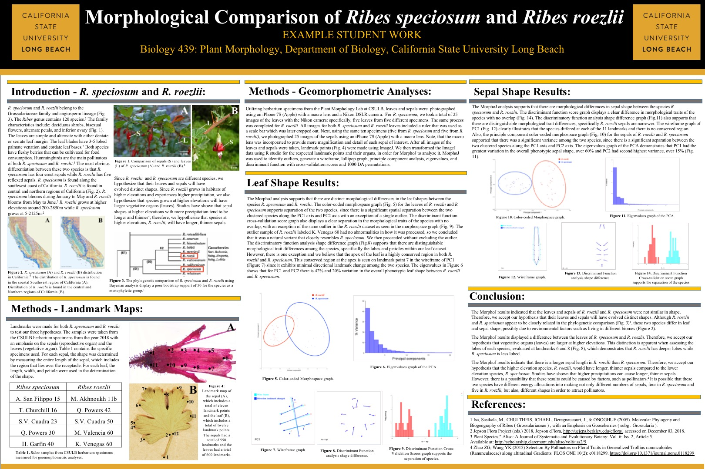
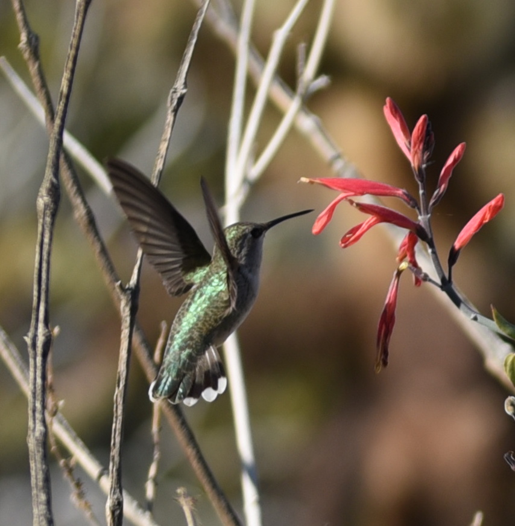

<link rel="stylesheet" href="styles.css" type="text/css">

## **BIOL427 Plant Systematics** 
is taught every Spring semester and surveys the vascular plant families, with a focus on California plants. Each student prepares a dried plant collection through participation on field trips. 

***
## **BIOL439 Plant Morphology**
is taught every Fall semester. Students learn the morphology and anatomy of plants and techniques for geomorphometric analysis of plant form. 

***

## **BIOL490/590 Pollination Biology**
is a seminar focused on recent primary literature. Students present papers and observe pollinators for a plant on campus. 

